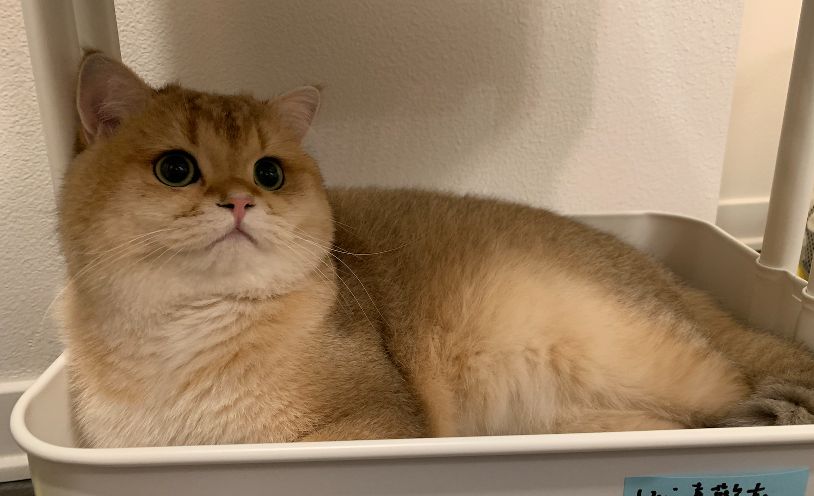

# **Eric's User Page**




### Table of Contents
- [**Eric's User Page**](#erics-user-page)
    - [Table of Contents](#table-of-contents)
    - [Introduction](#introduction)
    - [Who I am as a Programmer](#who-i-am-as-a-programmer)
    - [Relative Links](#relative-links)
    - [Git Commands I Learned in This Lab](#git-commands-i-learned-in-this-lab)
    - [Markdown Been Used on the Page](#markdown-been-used-on-the-page)

### Introduction
Hello, my name is [Eric](https://www.linkedin.com/in/hungyuko/). I am currently a fourth-year student pursuing a **Cognitive Science** *with a Specialization in Design and Interaction* major with a minor in **computer science** at the **University of California, San Diego**. In my free time, I watch YouTube and Netflix and play video games. As you can tell from the picture above, I am a cat person. The cat in the picture is my roommate's cat during my internship at Irvine. His name is Uni, and I really enjoyed his accompany during my time at Irvine. Hopefully, I can get my own cat in the future. 

### Who I am as a Programmer
I have learned and used 
1. Python, 
2. Java, 
3. C, 
4. C++, 
5. HTML, 
6. CSS, 
7. JavaScript, 
8. MySQL, 
9. PHP,
10. Apache, 
11. Linux

I am trying to learn other programming languages or strengthen my previously known skills step by step. I do not consider myself an experienced programmer since I declared my future career path as a software engineer in my third year, which is later than the other. Luckily, I had the chance to intern at [Advantech](https://www.advantech.com) as an Application Engineer this summer at Irvine. During the internship, I developed a webpage to monitor server machines that provide instant updates on 
- FRU, 
- PoE, 
- DMIDECODE, 
- sensors and 
- controls PoE ports. 
  
I also Assembled server machines and conducted 
- memory tests, 
- CPU tests, 
- and other testings 

to ensure the quality of deliverables. 

On my first day of internship, the general manager said this to the interns at the orientation: 

> better to try and fail than not try at all.

I made many mistakes during the internship, which is why I learned a lot during my internship. 

### Relative Links
- [link to README.md file](README.md)
- [link to command screenshot](screenshots/command%20line.png)
- [link to gitignore file screenshot](screenshots/gitignore%20file.png)
- [link to gitignore screenshot](screenshots/gitignore.png)
- [link to vscode scrrenshot](screenshots/vscode.png)

### Git Commands I Learned in This Lab
```
git clone <url>
git add <file/directory name>
git commit -m "message"
git status
git branch <branch name>
git checkout <branch name>
git merge <branch name>
git push
```

### Markdown Been Used on the Page
- [x] Headings
- [x] Styling Text
- [x] Quoting Text
- [x] Quoting Code
- [x] External Links
- [x] Section Links
- [x] Relative links
- [x] Ordered and Unordered Lists 
- [x] Task lists 